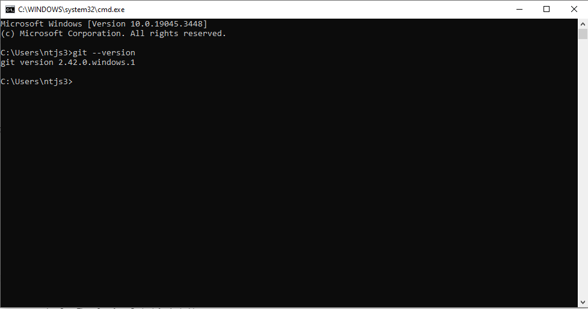

# How to: Install Git

## Introduction

This short tutorial will guide you through the steps necessary to install [Git](https://git-scm.com/). You will need to install Git if you want to link the Github repository to Oxygen (set it and forget it), but you won't need it to make any changes to the repository through the web.

## What is Git?

Git is the software responsible for version control, and is the industry stadard in software development. Git is the offline, local, equivalent to GitHub (or, more accurately, you can think of GitHub as the cloud backup to your Git version history). If you simply change a document and then upload it to github, only the uploaded version will be part of the document version history; having git installed will allow you to track any intermediary changes as well.

## Requirements
- None

## Instructions

1. Head over to [https://git-scm.com/downloads](https://git-scm.com/downloads)
1. Download the git version for your system:
    - For **Windows**:
        1. Download the 'Standalone Installer' in the correct architecture (normally 64-bit)
        1. Execute the downloaded file and follow the on-screen instructions
    - For **Mac**:
        1. Ensure you have Homebrew installed:
            1. Open a terminal window (click the Launchpad icon in the Dock, type Terminal in the search field, then click Terminal.) and type `brew help`.
            1. If you see a message like `command not found` you will need to install Homebrew: head over to [https://brew.sh/](https://brew.sh/) and follow the instructions there
        1. If you have Homebrew, open a terminal window, type `brew install git`, and follow the on-screen instructions
1. That's it. To confirm Git has been successfully installed, open a terminal window (windows key + R,  type `cmd`, press enter on windows; click the Launchpad icon in the Dock, type Terminal in the search field, then click Terminal on Mac), and type `git --version`. If everything went well, you should see a 'git version x.xx.x' message on the terminal.

