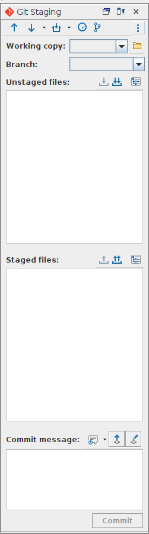

# How to: Link Oxygen and Github

## Introduction
This short tutorial will guide you through the steps necessary to link the repository where the TEI data is stored on github to your local Oxygen copy. This will allow you to work entirely from Oxygen, including downloading any changes and uploading any files you have been working on. Once you have it setup, it will make the process much easier and intuitive.

## Requirements
- Oxygen (follow the instructions in [here](https://www.oxygenxml.com/xml_editor/download_oxygenxml_editor.html) if you haven't downloaded, installed and registered Oxygen yet.)
- Git ([follow this guide](../02_Install_Git/02_install_git.md) if you haven't done so yet)

## Instructions
1. Open Oxygen
1. Open the 'Tools' menu and select 'Git Client'
    
1. The first time you do it, Oxygen will ask you if you want to install the plugin -- click 'Install' and follow the onscreen instructions. You might need to restart Oxygen for the changes to take effect.
1. Open the Git plugin for Oxygen (`Tools > Git Client`)
    
1. Click the three dots on the top right of the panel
1. Select `Clone new repository`
    
1. On the window that opens type:
    1. The repository URL: `https://github.com/NewcastleRSE/beeing-human-tei-data.git`
    1. Leave the checkout branch as the default
    1. Choose a folder in your computer to store the files. Remember the location.
        
        1. Cloning the repository will create a subfolder with repository name at the location you chose, so instead of creating a folder like `tei-data`, create a general folder like `projects` and use that.
1. All done! To make sure everything worked as it should, open the `1623.xml` file in the folder you have just created, make any small change and save the file. You should now see something new in your Git Plugin window:

1. If the change was just for testing purposes, right click on the file name in `Unstaged files` and click `Discard`
.
1. The first time you `commit` any changes, the Git client will ask you for your credentials: simply type your GitHub username and password and everything should work.