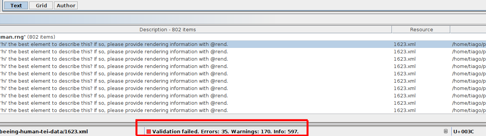
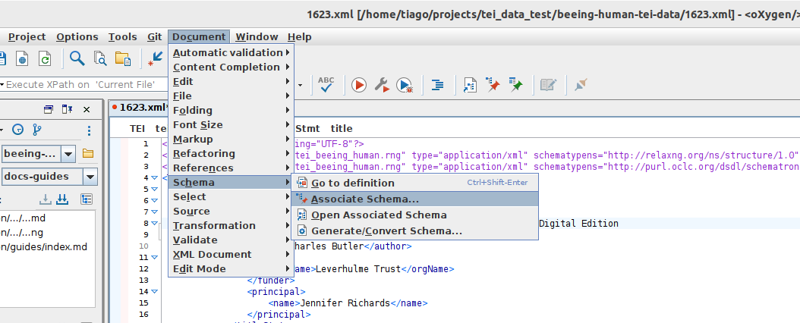
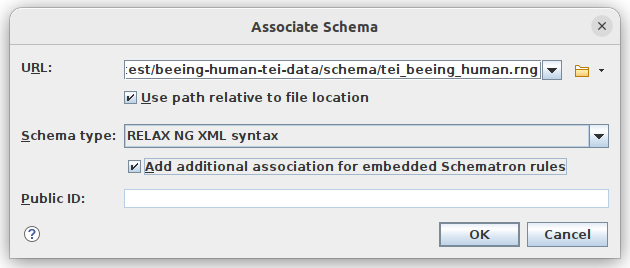

# How to: Associate a Schema with your TEI file in Oxygen

## Introduction
This is a quick reminder about how to verify that your TEI file is using the correct schema (i.e., customisation). If you followed the instructions on how to link Oxygen and Github, everything *should* just work, but in case it doesn't, here's how to make sure.

## Check if the schema is correctly associated
At the time of writing, if the schema is correctly associated, you should fail the validation in Oxygen (red square), and you should see a list of 35 errors, 170 warnings, and 597 info. Specifically, one of the types of warnings on the list should be the following:

> 'Is 'hi' the best element to describe this? If so, please provide rendering information with @rend.'



### Checking after the initial setup
If you are reading this long after those errors and warnings were cleared, the easiest way to check is to try and create a new note anywhere on the body of the text. If the schema is correctly associated with the file, you should see an error message stating that a note must have a `@type` and a `@subtype` attribute.

## Associating the schema with the TEI file
If, for some reason, the schema is not automatically associated with the file, follow these steps:

1. Ensure that there is no schema annotation between the `xml version` declaration and the start of the `<TEI>` element. So, if you see something like this:

```
<?xml version="1.0" encoding="UTF-8"?>
<?xml-model href="schema/tei_beeing_human.rng" type="application/xml" schematypens="http://relaxng.org/ns/structure/1.0"?>
<?xml-model href="schema/tei_beeing_human.rng" type="application/xml" schematypens="http://purl.oclc.org/dsdl/schematron"?>
<TEI xmlns="http://www.tei-c.org/ns/1.0">
```

you need to erase the middle two lines (starting with `?xml-model`) so that it looks like this:

```
<?xml version="1.0" encoding="UTF-8"?>
<TEI xmlns="http://www.tei-c.org/ns/1.0">
```

2. In Oxygen, click `Document > Schema > Associate Schema...`



3. In the dialogue box that shows up, select the correct schema file.
    1. Click the little folder icon to the right of the URL field
    1. The schema file will be inside the project folder, inside a folder called `schema`, and it will be called `tei_beeing_human.rng`
    1. Make sure the box that says 'Use path relative to file location' is ticked
    1. Make sure the Schema Type is 'Relax NG XML Syntax'
    1. Tick the box that says 'Add additional association for embedded Schematron rules'
    1. Click Ok



4. Follow ths instructions [above](./04_Associate_Schema.md#check-if-the-schema-is-correctly-associated) to make sure everything went smoothly.
