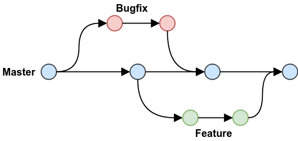

# Github concepts

## Branches
A fundamental concept in Git and GitHub is that of **branches**. You can think of a GitHub repository as a tree where the main development branch is the trunk, with other branches sprouting from that trunk (or from smaller branches along the way). Where the metaphor starts to fall apart is when, further down the development cycle, the branches merge once again with the main development trunk. Here's a simple diagram to illustrate this principle:

In the diagram, 'Master', 'Bugfix', and 'Feature' are three separate branches of the same repository. Each of the nodes represents a [commit](./10_github_concepts.md#commit), and each point where the branches reunite represent a [pull request](./10_github_concepts.md#pull-request). This is the standard GitHub workflow.

Generally speaking, changes should be grouped thematically and made in branches. In regular software development this would be the development of a new feature, or the fixing of a particular bug. Creating a new branch to do this allows the developer to test out the fix or the new feature *without danger to the rest of the project*. Once that feature or bugfix is complete, you can create a [pull request](./10_github_concepts.md#pull-request) which will merge the new changes with the existing project.

In our case, branches should represent groups of related changes to the TEI file: for example, adding `@target` attributes to internal references marked with a `<ref>` element should all be made in the same branch. Isolating that task means that any errors introduced during this process should be isolated from the main development branch (and therefore should not pass the [pull request](./10_github_concepts.md#pull-request) review).

## Commit

## Pull request

## Push