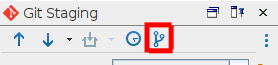
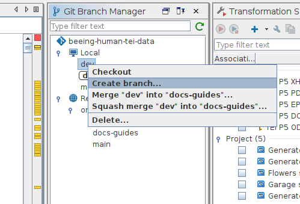
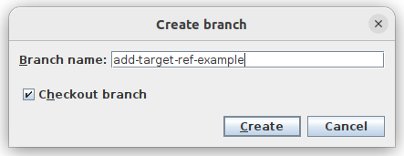

# How to: create a new branch on the GitHub repository

## Introduction
Every time you start a new task, you should create a new branch in the repository.

[Branches](/documentation/guides/10_GitHub_Concepts/10_github_concepts.md#branches) represent groups of related changes to the TEI file: for example, adding `@target` attributes to internal references marked with a `<ref>` element should all be made in the same branch. Isolating tasks means that any errors introduced during this process should be isolated from the main development branch (and therefore should not pass the [pull request](/documentation/guides/10_GitHub_Concepts/10_github_concepts.md#pull-request) review).

You can do this directly on Oxygen.

## Instructions
1. Make sure you can see the Git panel (if not, click `Tools>Git Client`)
1. In the Git Client panel, click the icon that looks like a curved line coming out of a straigth line (top right)

1. You should now see a new panel called 'Git Branch Manager'. There should be two sections: 'Local' and 'Remote'. Local refers to the branches currently in your machine, while Remote refers to branches that are store in the GitHub repository. They should normally be the same but, if not, the Remote always represents the truth of the repository unless you have just created a new branch.
1. To create a new branch, right click on 'dev' on the local repository and select 'create new branch...'. This will create a new branch from the 'dev' branch. You can also create new branches from other feature branches, but generally speaking you should be working from 'dev', which represents the latest stable version of the files.

1. In the dialogue that appears, give the new branch a meaningful name. *Do not use spaces* or other special characters. Words are normally separated by hypens.

In the example above, you can see that this branch will add `@target` to `<ref>` elements just from its name.
1. Ensure the 'Checkout branch' box is ticked and click 'Create'.
1. In the 'Git Branch Manager', you should now see a new branch under local. Don't worry about it not showing up in the Remote just yet, it should be added once you [push](/documentation/guides/10_GitHub_Concepts/10_github_concepts.md#push) your first [commit](/documentation/guides/10_GitHub_Concepts/10_github_concepts.md#commit) to this branch.
