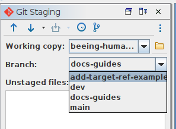

# How to: Ensure you are working in the correct branch

## Introduction
Before making any changes to the TEI document, you need to ensure you are working in the correct [branch](/documentation/guides/10_GitHub_Concepts/10_github_concepts.md#branches). Doing this in Oxygen couldn't be simpler.

## Instructions
1. Make sure you can see the Git Panel (`Tools>Git Client`)
1. If the name in the 'Branch' field is not what you expect, simply click the arrow and select the correct branch name. You can now continue to make changes to that branch.
