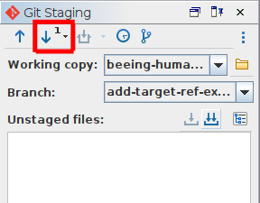

# How to: Pull new changes to the branch

## Introduction
After ensuring you are working on the correct branch, it is vital that you [pull](/documentation/guides/10_GitHub_Concepts/10_github_concepts.md#pull-changes) any new changes to the branch. Doing this in Oxygen, is again, very simple.

## Instructions
1. Ensure you can see the Git Client panel (`Tools>Git Client`)
2. [Ensure you are in the correct branch](../12_ensure_correct_branch/12_ensure_correct_branch.md)
3. On the top left of the Git Client panel, click the downard pointing arrow. If there are any new changes, the arrow will also have a number with it.

4. Your local repository will now be up to date. If you want to make sure, you can also hover over the 'pull' button until an info box appears which should read 'up to date'.