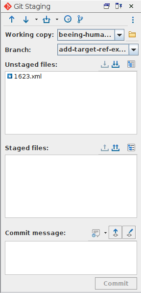
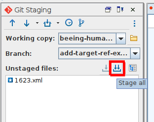
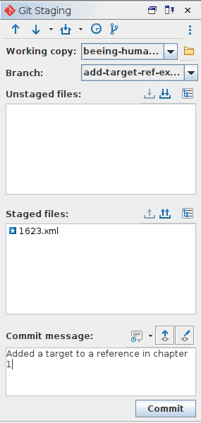
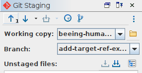

# How to: stage and commit your changes to the repository

## Introduction
[Staging](/documentation/guides/10_GitHub_Concepts/10_github_concepts.md#stage) and [commiting](/documentation/guides/10_GitHub_Concepts/10_github_concepts.md#commit) changes are the essential steps in the Git and GitHub workflow. This is when you explicitly create a recoverable point in the history of the repository. Staging and committing changes is fairly easy to do in Oxygen.

## Example
Let's say I want to make a change to our TEI file. Specifically, I want to add a `@target` to one of our `<ref>` elements.
1. First, [we ensure we are working in the correct branch](/documentation/guides/12_ensure_correct_branch/12_ensure_correct_branch.md) (in this case the branch is `add-target-ref-example`)
1. We're going to change the following `<ref>`:

```
<ref target="#">V.c. 5.n. 46.&amp;47.</ref>
```

1. This `<ref>` actually contains two internal cross-references, so it should be broken into two. The correct change therefore should be:

```
<ref target="#ch5sumn46">V.c. 5.n. 46.</ref>&amp;<ref target="#ch5sumn47">47.</ref>
```

1. And now that we made the change, we can save the file.

## Staging and committing the change
1. Once the file is saved, you should be able to see the file name in the 'Unstaged files' section of the Git Client.

1. To stage, simply click the 'Stage all' button at the top right of the 'Unstaged files' section. The file name will now move to the 'Staged files' section.

1. At this point, you should add a commit message: a commit message should be short and descriptive. In this case, we're going to write: 'Added a target to a reference in chapter 1'

1. After writing the commit message, the 'Commit' button at the bottom of the Git client panel should be active. Click on it to commit the changes to the repository.
1. After commiting, don't forget to [push](#) the changes to the remote repository.


## Commit history
'Commit little, commit often': the more commits to a repository, the easier it is to revert changes to a specific point in history without unnecessary loss of work. As an example, this is what the commit history to the branch where I am writing these guides look like up to just before I wrote this paragraph:
