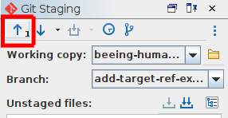

# How-to: Push changes to the remote repository

## Introduction
You should [push](/documentation/guides/10_GitHub_Concepts/10_github_concepts.md#push) changes to the remote repository as soon as you've committed them. This ensures that the remote repository is always up to date, and that anyone working at the same time in the same branch always has access to the latest version of the files. Pushing changes in Oxygen is, again, very easy.

## Instructions
1. Ensure you can see the Git Client panel (`Tools>Git Client`)
1. As soon as you've [committed a change](/documentation/guides/14_stage_commit/14_stage_commit.md), the push button at the top left of the panel (an arrow pointing upward) will become active, and have a number representing the number of commits that need to be pushed. Simply click the button to push, and you're done!
