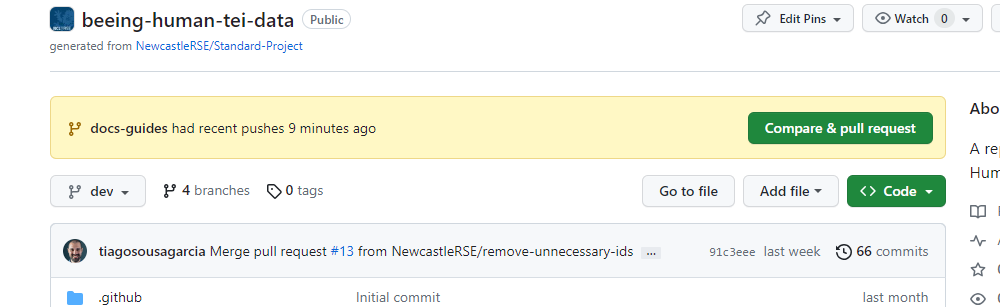
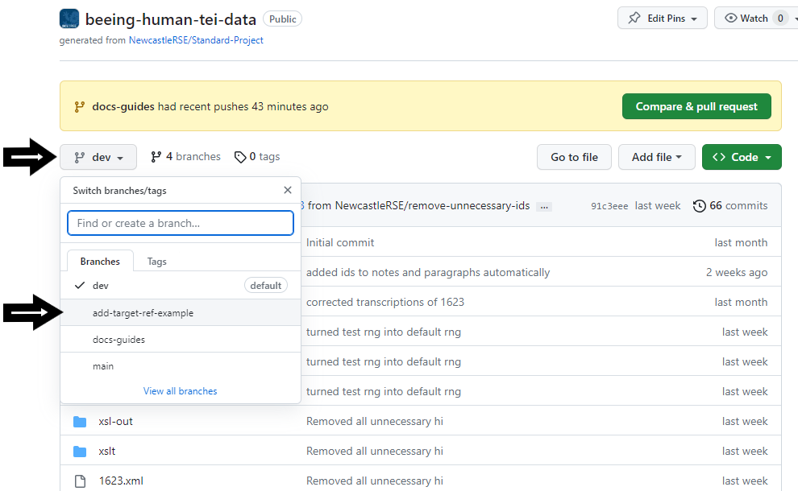
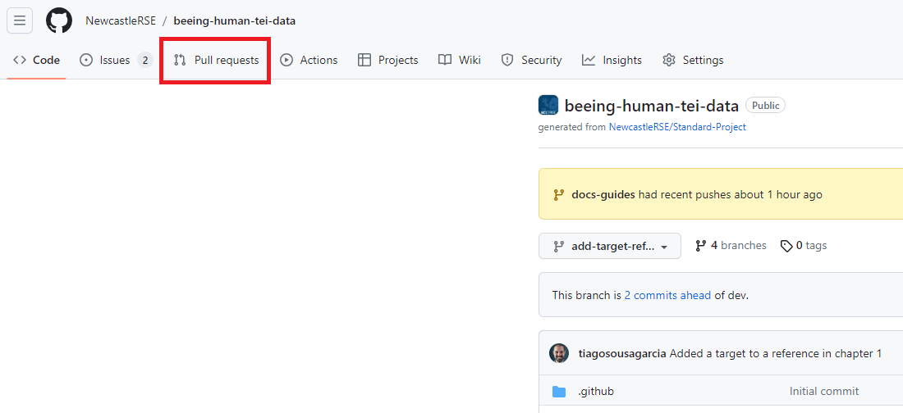
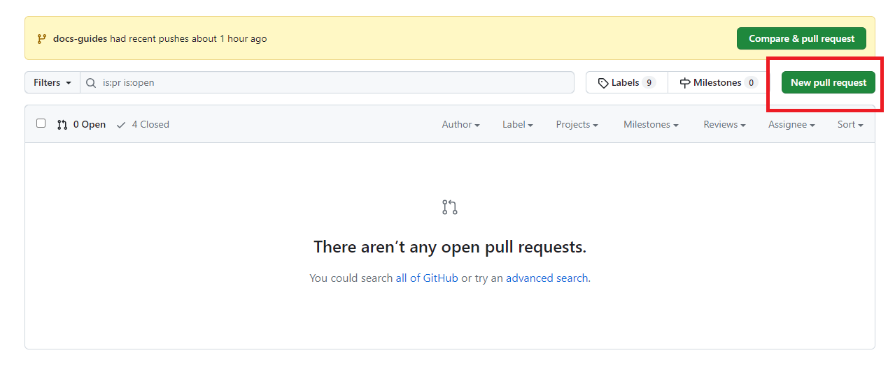
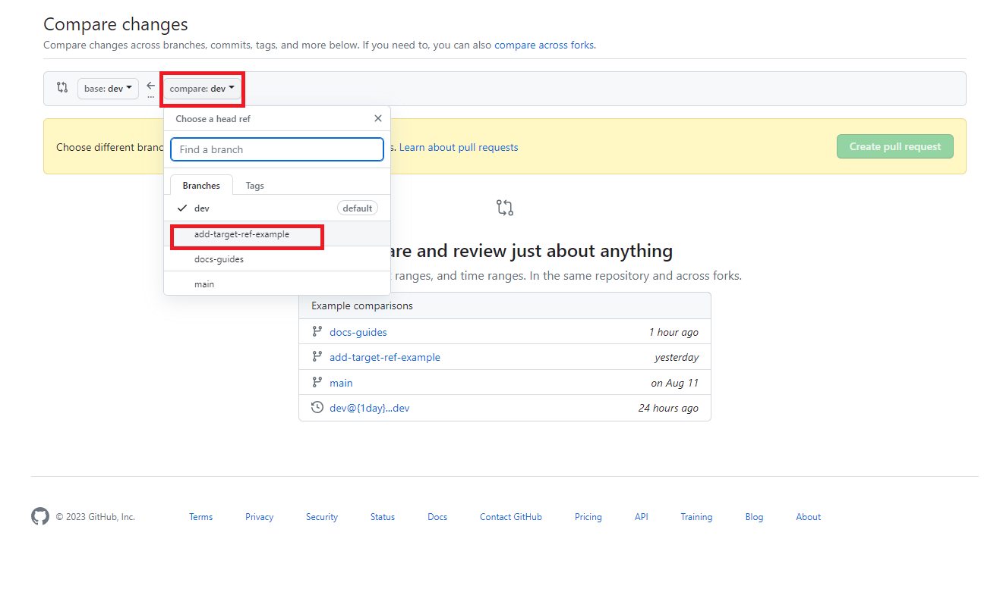

# How to: create a pull request

## Introduction
Once you have made all the changes that you need to do in a particular branch -- say, you've added `@targets` to all the `<ref>` elements -- it's time to merge your work with a  [pull request](/documentation/guides/10_GitHub_Concepts/10_github_concepts.md#pull-request). Although you can technically do this from Oxygen, using the web interface for this process is clearer (in my opinion), so that's what we will do.

## Requirements
- Ensure you have followed all the steps in the [making changes](/documentation/guides/index.md#making-changes), particularly the last three:
  - Adding a line to `<revisionDesc>`
  - [Staging and commiting the latest changes](/documentation/guides/14_stage_commit/14_stage_commit.md)
  - [Pushing the changes to the remote repository](/documentation/guides/15_Pushing_Changes/15_push_changes.md)

## Instructions
1. Head to the repository page on Github: [https://github.com/NewcastleRSE/beeing-human-tei-data](https://github.com/NewcastleRSE/beeing-human-tei-data)
2. Make sure you are logged in to Github (you should see your little avatar on the top-right of the screen)
3. If you have just [pushed](../15_Pushing_Changes/15_push_changes.md) some new changes, you might see a banner like the following:

(You can, if you wish, start the pull request by clicking the green 'Compare & Pull request' button, but we are going the long way around.)

4. In the web interface, **make sure you are in the correct branch**. You should be in the branch you want to merge. So, if we want to merge the `add-target-ref-example`, click the dropdown menu at the top left above the repository files, and choose the correct branch name.

5. Once you are in the correct branch, click on the `Pull Requests` tab at the very top of the screen

6. Click on the green `New pull request button`

7. Choose which branches to merge. The branch on the left is the branch it will be merged into (the stable branch), while the branch on the right is the one you've been working on. Change the branch on the right ('compare:') to be the branch you have been working. Once you've changed the branch, you will see a summary of the changes on that branch. If you are happy with everything, click on `Create pull request`.

8. 