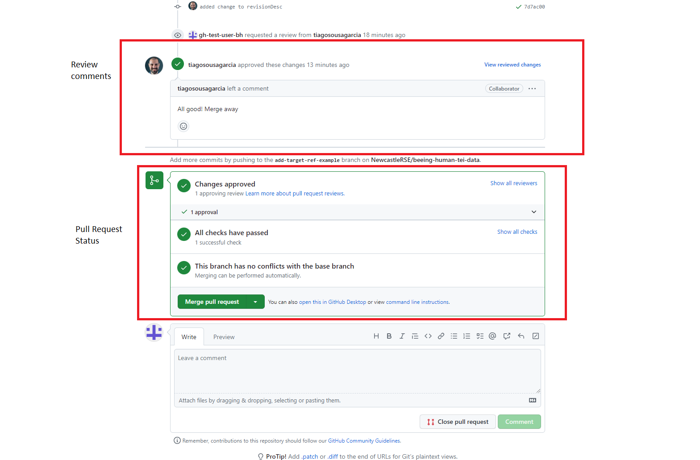

# How to: Merge Changes after pull request

## Introduction
Once your pull request has been approved (if it hasn't been approved, follow whatever instructions were given), you need to finalise it by merging the changes to the `dev` branch.

## Requirements
- An active [pull request](/documentation/guides/21_create_pull_request/21_create_pull_request.md)
- A positive review of the pull request

## Instructions
1. Once your pull request has been approved, you will receive an email confirming it. You can follow the links in the email to go to the pull request page or:
2. Go to the repository page [https://github.com/NewcastleRSE/beeing-human-tei-data](https://github.com/NewcastleRSE/beeing-human-tei-data)
3. Click on the `Pull requests` tab
4. Click on the pull request you created
5. Navigate towards the bottom of the page: check the review notes (in case there's something that needs doing) and if everything is correct, and everything is green in the status panel, click the `Merge pull request` button.

6. Click `Confirm merge` in the panel that shows up
7. Finally, delete the branch from the remote repository by clicking on the `Delete branch` button that just appeared. This isn't strictly necessary, but helps keeping the repository tidy.