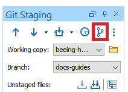
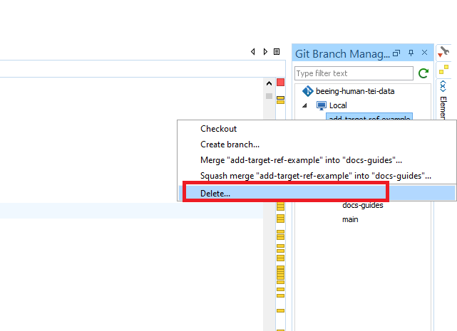

# How to: delete local branches

## Introduction
Once you have merged the changes from your feature branch into the main development branch, you can delete your copy of the now non-existent branch. Strictly speaking, you don't have to do this, but it helps to keep everything tidy.

## Requirements
- Ensure your branch has been merged and has been deleted from the remote repository.

## Instructions
1. Open the Git Client panel on Oxygen (`Tools>Git Client`)
2. Open the Git Branch Manager view by clicking the top right icon on the Git Client panel

3. On the branches view, you should see that you have one more branch under `local` than you do under `remote`: that's the branch we want to delete.
4. Right-click on top of the branch you want to delete and click `Delete...`

5. Confirm you want to delete the branch and you are all done!